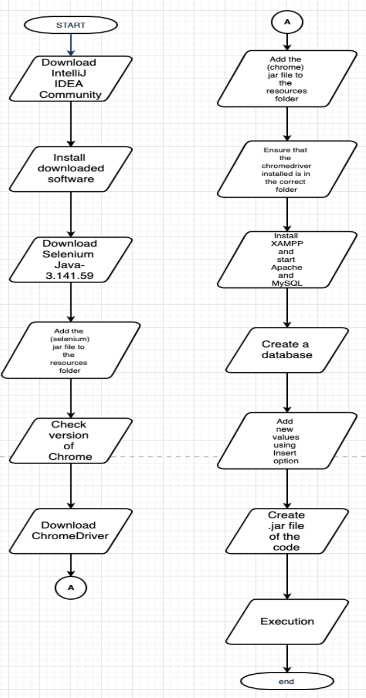

# SQL Map implementation tool

Website vulnerability is a big issue for people who host their services on the web. There can be a leak of personal and private information to hackers and other people with ill intentions if the website is not secure. Data leaks of personal information such as passwords and email IDs take place when hackers get unauthorised access to databases and query them to retrieve personal data. Such types of attacks on websites are called injection attacks and are one of the most common and easy ways to attack a website and gain unauthorised access to data. The tool used, SQLMAP, provides the user an automated method to check if a website is vulnerable and also allows the user to perform an injection attack, to see exactly where the vulnerabilities lie.

**Features:**

- Exploit SQL injection vulnerability
- Extract databases and database user detail entirely
- Allows enumeration of users, passwords, database tables and columns
- Support to parse HTML forms from the target URL and forge HTTP(S) requests against those pages to test the form parameters against vulnerabilities.
- Support to indicate vulnerability of a website 
- Cross-platform compatibility: This software has been made compatible and implemented on Windows, Linux and iOS systems.
- Web GUI that makes it easier for relatively new users to implement
- Supports MySQL
- Use of Selenium for automating web applications for testing purposes
- Types of injection techniques implemented: 
  1. Boolean-based blind SQL injection
  2. Union-based SQL injection
  
  
